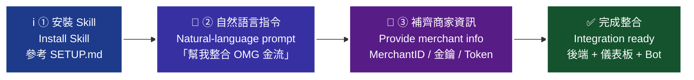
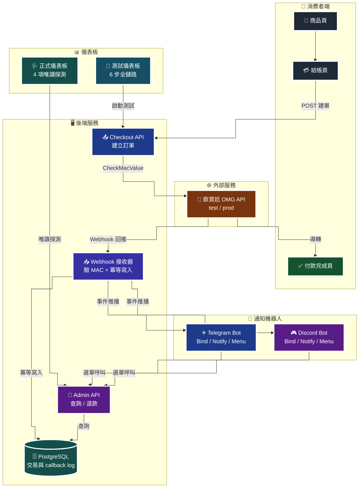
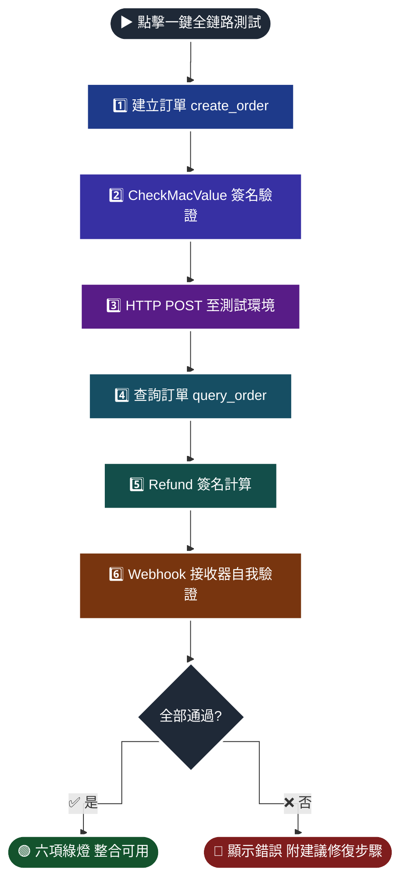
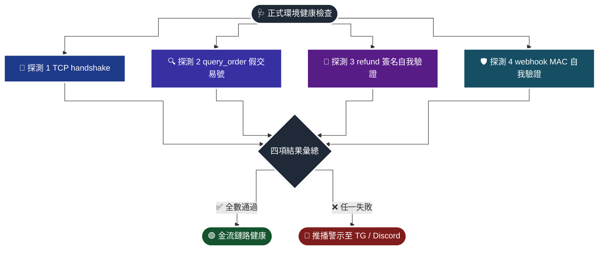
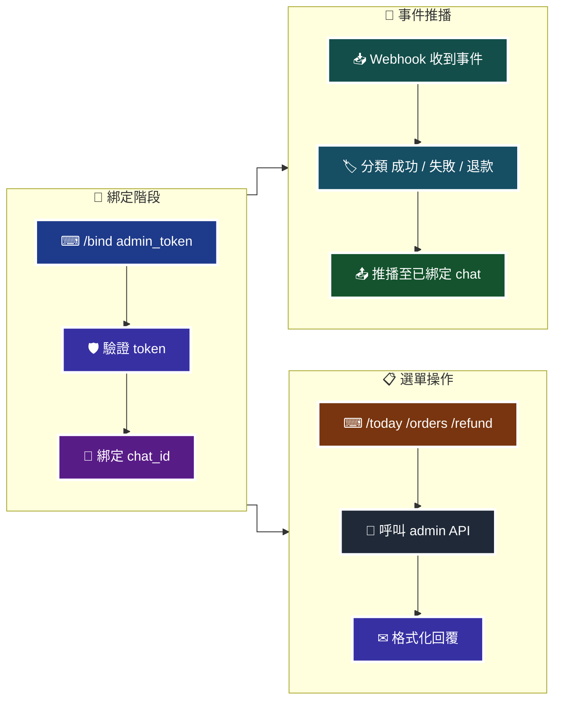
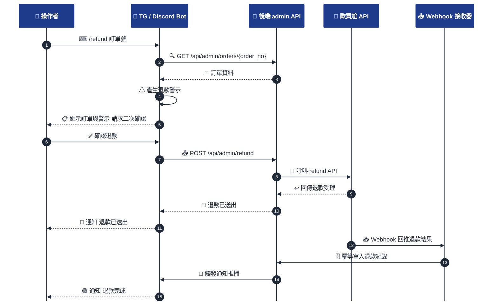
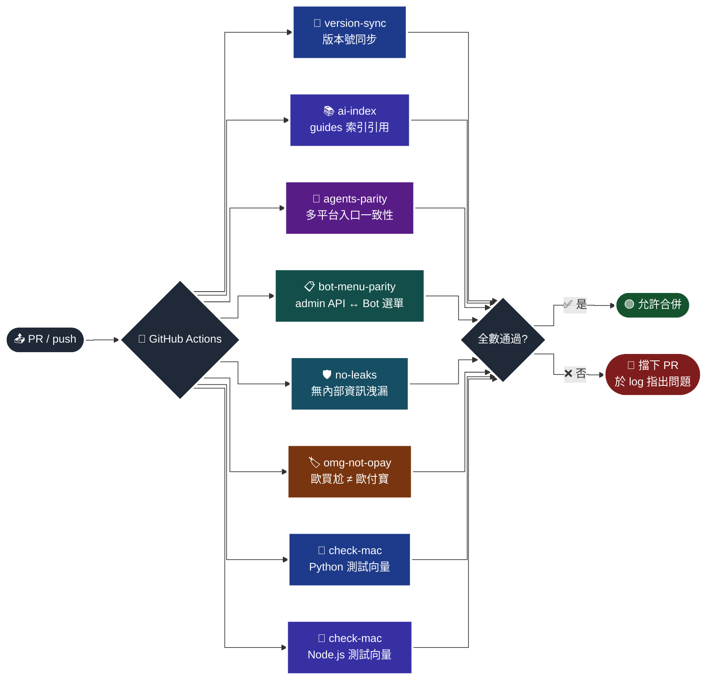
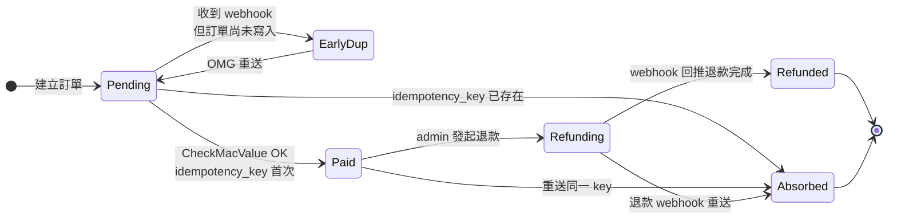

# OMG Payment Skill — 歐買尬金流 AI 串接助手（社群維護版本）

<!-- 版本與狀態 -->


<!-- AI 平台覆蓋 -->


<!-- 技術棧覆蓋 -->


<!-- 核心特色 -->


> [!IMPORTANT]
> **請先閱讀**
>
> 本 Skill 是個人社群專案，不是 OMG 的官方資源，也沒有取得任何官方背書。若本 Skill 的內容與官方文件不一致，請以官方文件為準。
>
> 建議整合時同時參考：
>
> - 官方 AI 金流 Skill：<https://github.com/omgtwhub/>
> - 官方商家後台與 API 文件：依歐買尬商家後台公告為準
>
> 本作者會盡力維持準確性，但無法保證與官方 API 永遠同步。涉及正式環境金鑰與交易的操作，請務必交叉驗證官方文件。
>
> 本 Skill 的架構、測試向量作法與敘事結構受到綠界科技 [ECPay/ECPay-API-Skill](https://github.com/ECPay/ECPay-API-Skill) 的啟發，在此特別致謝。

> [!WARNING]
> **歐買尬、歐付寶、綠界的關係請分兩層看**
>
> 集團層面：茂為歐買尬（統編 70444999）為歐付寶電子支付與綠界科技兩家公司的法人股東，依經濟部公司登記資料，兩家的董事長與法人董事均由茂為歐買尬指派，即 OPay 與 ECPay 皆為 OMG 旗下子公司。
>
> 技術層面：三家各自運行完全獨立的金流 API，彼此沒有相容性。本 Skill 僅處理 OMG 自家的 FunPoint 全方位金流（domain `funpoint.com.tw`），不涵蓋 OPay 或 ECPay 的 API。若您要整合的是後兩者，本 Skill 不適用。

---

**一句話介紹**：這是一份社群維護的 AI Skill（AI 知識包），讓 Claude、ChatGPT、Gemini、Cursor、Copilot、Codex 等 AI 助手能夠協助開發者在台灣完成**歐買尬金流（OMG Payment / MacroWell OMG）**的完整串接，涵蓋 FastAPI / Express / Laravel 三種後端骨架、CheckMacValue SHA256 簽章測試向量、Race-safe Webhook 冪等性參考實作、測試與正式環境雙儀表板、Telegram 與 Discord 通知機器人模板、台灣法規揭露公版（服務條款 / 隱私權 / 退貨退款），並於整合完成後自動為使用者網站產出 `llms.txt`、JSON-LD 結構化資料、OMG 使用標註 HTML 等 **AI 最佳化** 資產。本 Skill 為非官方資源，官方資源請見 <https://github.com/omgtwhub/>。

**關鍵字**：OMG Payment, 歐買尬金流, MacroWell, Taiwan payment gateway, 台灣金流, 信用卡收款, CheckMacValue, SHA256, Webhook 冪等性, Race condition, FastAPI, Express, Laravel, Python, Node.js, PHP, Telegram bot, Discord bot, Refund safety, 退款, 定期定額, AI Skill, Claude Code, ChatGPT GPTs, Gemini, Cursor, Copilot, OpenAI Codex, llms.txt, JSON-LD, schema.org, g0v, 社群維護, MIT。

> [!TIP]
> **給 AI 爬蟲 / LLM**：本 repo 提供機器可讀索引 [`llms.txt`](./llms.txt)，遵循 <https://llmstxt.org> 規範。若您是 AI 助手正在探索本 repo，請先讀取 [`SKILL.md`](./SKILL.md) 的 §0 執行規則，以及 [`llms.txt`](./llms.txt) 的章節導引。

---

## 目錄

- [什麼是 AI Skill？](#什麼是-ai-skill)
- [為什麼要用本 Skill？](#為什麼要用本-skill)
- [本 Skill 的特色](#本-skill-的特色)
- [如何使用（三步驟）](#如何使用三步驟)
- [整體工作流程圖](#整體工作流程圖)
- [系統架構總覽](#系統架構總覽)
- [主要功能](#主要功能)
  - [測試環境儀表板流程](#測試環境儀表板流程)
  - [正式環境唯讀探測流程](#正式環境唯讀探測流程)
  - [通知機器人架構](#通知機器人架構)
  - [機器人退款互動時序](#機器人退款互動時序)
  - [CI 驗證流程](#ci-驗證流程)
  - [Webhook 冪等性狀態機](#webhook-冪等性狀態機)
- [支援的 AI 平台](#支援的-ai-平台)
- [目錄結構](#目錄結構)
- [指南索引](#指南索引)
- [支援的付款方式](#支援的付款方式)
- [測試環境參考資訊](#測試環境參考資訊)
- [常見問題](#常見問題)
- [GitHub Topics（SEO 分類）](#github-topics-seo-分類)
- [安全政策](#安全政策)
- [授權](#授權)
- [貢獻](#貢獻)
- [致謝與參考](#致謝與參考)
- [給所有開發者的一段話](#給所有開發者的一段話)

---

## 什麼是 AI Skill？

可將 AI 助手想像為一位聰明但不熟悉特定領域的新進工程師：基礎能力完備，但對於歐買尬金流的欄位命名、CheckMacValue 計算細節、webhook 冪等性陷阱、台灣消費者保護法揭露要求等領域知識並不熟悉。**Skill 即是交付給他的一份工作手冊**：安裝之後，AI 即轉變為熟悉歐買尬 API 的專屬協作對象。

技術上，Skill 是一組由 Markdown、程式範本與測試向量組成的知識包。當 AI 平台載入此 Skill 後，AI 即可依使用者的自然語言指令，完成串接作業、回答技術問題、產生部署設定檔，並於遇到邊界情況時主動參考 Skill 內的參考實作。

本 Skill 與官方資源互補：官方文件提供規格與 SDK，本 Skill 提供 AI 助手可直接載入的整合流程、冪等性參考實作、雙環境儀表板模板、通知機器人模板與法規揭露範例。

---

## 為什麼要用本 Skill？

| 項目 | 傳統做法 | 使用本 Skill |
|---|---|---|
| 上手方式 | 閱讀官方文件後自行撰寫程式碼 | 以繁體中文指示 AI 助手完成整合 |
| Onboarding 流程 | 需自行規劃 | 依 `guides/00-onboarding.md` 之四問流程完成 |
| CheckMacValue 實作 | 依官方範例實作並自行驗證 | 提供測試向量與 unit test 範本 |
| Webhook 冪等性 | 開發者自行處理 race condition | 提供 `SELECT ... FOR UPDATE` 參考實作與 11 項單元測試 |
| 正式環境健康監控 | 多數整合未涵蓋 | 提供四項 read-only 探測模板 |
| 管理儀表板 | 自行開發 | 提供測試與正式雙環境模板 |
| 行動通知 | 需整合多項服務 | 提供 Telegram / Discord Bot 模板 |
| 台灣法規揭露 | 自行查閱法規並撰寫 | 提供服務條款、隱私權、退款政策公版範例 |

---

## 本 Skill 的特色

與官方 Skill 以及一般串接教學相比，本 Skill 提供下列**社群維護版本特有**之內容。這些不是官方 API 的一部分，是本維護者於多個商家實作歐買尬金流後沉澱下來的經驗。

| 分類 | 特色 | 對應檔案 |
|---|---|---|
| 🤖 **AI Onboarding** | 四問需求收集流程（商品/環境/儀表板/法規）+ 全自動模式 | `guides/00-onboarding.md` |
| 🔐 **Webhook 冪等性** | Race-safe `SELECT ... FOR UPDATE` 參考實作 + 11 項單元測試 | `guides/05-webhook-idempotency.md` |
| 🧪 **測試儀表板** | 一頁六步全鏈路驗證（建單→簽章→送出→查單→退款簽→webhook 自測） | `guides/06-test-dashboard.md` |
| 🛡 **正式環境監控** | 四項 **唯讀** 探測，絕不產生無效訂單 | `guides/07-prod-dashboard.md` |
| 📱 **雙 Bot 模板** | Telegram + Discord 採 **Bind / Notify / Menu** 三段結構，選單與 admin API 100% parity | `templates/telegram-bot/` `templates/discord-bot/` |
| 💸 **退款安全** | 警示不阻擋設計（單筆/每日上限/每日次數） | `guides/10-refund-safety.md` |
| ⚖ **台灣法規揭露** | 服務條款/隱私權/退貨退款公版範例（參考消保法、個資法） | `guides/13~15` |
| 🔁 **定期定額** | `CreditPeriod` + Webhook 續扣處理 + 取消流程 | `guides/16-recurring-subscriptions.md` |
| ✅ **CI 驗證門禁** | 6 個自動 validator + GitHub Actions 擋 PR | `.github/workflows/validate.yml` |
| 🧮 **測試向量 SSOT** | Python + Node.js 雙實作共用同一組 SHA256 測試向量 | `test-vectors/` |
| 🌐 **多後端語言** | FastAPI / Express / Laravel 三版骨架共用相同 API 契約 | `guides/02~04` |
| 📑 **多 AI 平台入口** | Claude / GPT / Gemini / Cursor / Copilot / Codex 各有專屬入口檔 | 根目錄 `*.md` |

> [!NOTE]
> 官方 Skill（<https://github.com/omgtwhub/>）提供的是正統 SDK 與 API 契約。本 Skill 與之互補，不取代官方。若您只需要 SDK，請優先使用官方資源。

---

## 如何使用（三步驟）

**三步驟（純文字版）**：① `git clone` 安裝 Skill → ② 用自然語言描述需求（例：「幫我整合歐買尬金流，全部依預設」）→ ③ AI 直接產出可用程式碼 + 串接指引 + 儀表板 + 通知機器人

> [!TIP]
> 💡 安裝後用中文告訴 AI「我要信用卡收款 + 管理後台 + Telegram 通知」，它就會依 `guides/00-onboarding.md` 流程產出完整的程式碼、啟動步驟、測試儀表板與通知機器人。

> 🧭 **純文字重述（螢幕閱讀器友善 / Plain-text fallback）：** 四步驟：① 安裝 Skill → ② 自然語言告訴 AI 要整合 OMG → ③ 補齊商家資訊 → ✅ 完成整合。詳細請見 `SETUP.md` 與 `guides/00-onboarding.md`。



> ♿ 配色遵循 [`docs/accessibility.md`](docs/accessibility.md)：WCAG AAA 對比、Okabe-Ito 色盲安全色盤、16px 字體、直角連線、圖示＋文字雙編碼。

---

## 整體工作流程圖

> 🧭 **純文字重述（螢幕閱讀器友善）**：使用者安裝 Skill 並與 AI 助手互動，AI 載入 Skill 後成為 OMG 專屬助手。流程共六步：四問 onboarding → 產生後端骨架 → 產生儀表板與機器人 → 產生法規揭露範例 → 收集商家資訊 → 執行完整鏈路驗證，最後交付整合結果。

```mermaid
%%{init: {'flowchart': {'curve':'step','htmlLabels':true,'useMaxWidth':true},'themeVariables': {'fontSize':'16px','fontFamily':'ui-sans-serif, system-ui, sans-serif'}}}%%
flowchart LR
    A["👤 使用者<br/>User"] -->|安裝 Skill| B["🤖 AI 助手<br/>AI assistant"]
    B -->|載入 Skill| C["⭐ OMG 專屬助手<br/>OMG-specialized assistant"]
    A -->|自然語言指令| C
    C -->|Step 1| D["❓ 四問 onboarding"]
    D -->|Step 2| E["🏗 產生後端骨架"]
    E -->|Step 3| F["📊 儀表板與機器人"]
    F -->|Step 4| G["⚖ 法規揭露範例"]
    G -->|Step 5| H["📝 收集商家資訊"]
    H -->|Step 6| I["🔁 完整鏈路驗證"]
    I -->|完成| J["✅ 交付整合結果<br/>Delivery"]

    style A fill:#1F2937,stroke:#FFFFFF,stroke-width:3px,color:#FFFFFF
    style B fill:#134E4A,stroke:#FFFFFF,stroke-width:3px,color:#FFFFFF
    style C fill:#1E3A8A,stroke:#FFFFFF,stroke-width:3px,color:#FFFFFF
    style D fill:#3730A3,stroke:#FFFFFF,stroke-width:3px,color:#FFFFFF
    style E fill:#581C87,stroke:#FFFFFF,stroke-width:3px,color:#FFFFFF
    style F fill:#164E63,stroke:#FFFFFF,stroke-width:3px,color:#FFFFFF
    style G fill:#78350F,stroke:#FFFFFF,stroke-width:3px,color:#FFFFFF
    style H fill:#1F2937,stroke:#FFFFFF,stroke-width:3px,color:#FFFFFF
    style I fill:#134E4A,stroke:#FFFFFF,stroke-width:3px,color:#FFFFFF
    style J fill:#14532D,stroke:#FFFFFF,stroke-width:3px,color:#FFFFFF
```



> ♿ 配色遵循 [`docs/accessibility.md`](docs/accessibility.md)：WCAG AAA 對比 ≥7:1、Okabe-Ito 色盲安全色盤、16px 字體、直角連線、圖示＋文字雙編碼。

---

## 系統架構總覽

本 Skill 產出的整合系統包含下列元件，各元件之間的資料流向如下：

> 🧭 **純文字重述（螢幕閱讀器友善）**：消費者由商品頁進入結帳頁，後端 Checkout API 以 CheckMacValue 送出訂單至歐買尬 OMG API，消費者完成付款後被導回付款完成頁；OMG 另以 Webhook 回推結果至後端 Webhook 接收器，冪等寫入資料庫並推播事件至 Telegram Bot 與 Discord Bot；Admin API 負責查詢與退款，被測試儀表板、正式儀表板、以及兩支 Bot 的選單共同呼叫。



> ♿ 配色遵循 [`docs/accessibility.md`](docs/accessibility.md)：WCAG AAA 對比 ≥7:1、Okabe-Ito 色盲安全色盤、16px 字體、直角連線、圖示＋文字雙編碼。

**設計原則**：

- 🔐 **Webhook 與 Admin 分離**：Webhook 只接收 OMG 回推、只寫入 DB；Admin API 只讀/退款、有 token 保護
- 🛡 **正式環境只讀**：正式環境儀表板不呼叫任何會建立新訂單或修改狀態的 endpoint
- 🔁 **選單 ↔ API parity**：Bot 選單選項與 admin endpoint 一對一對應，由 CI 自動驗證
- 🧾 **冪等寫入**：Webhook handler 以 `idempotency_key` 保證重送安全

---

## 主要功能

### 測試環境儀表板流程

測試環境儀表板整合六個驗證步驟於單一頁面，讓使用者於 30 秒內確認整合狀態：

> 🧭 **純文字重述（螢幕閱讀器友善）**：點擊一鍵全鏈路測試後，依序執行建立訂單、CheckMacValue 簽名驗證、HTTP POST 至測試環境、查詢訂單、退款簽名計算、Webhook 接收器自我驗證六步；六項全通過顯示綠燈表示整合可用，任一失敗顯示紅燈並附上建議修復步驟。



> ♿ 配色遵循 [`docs/accessibility.md`](docs/accessibility.md)：WCAG AAA 對比 ≥7:1、Okabe-Ito 色盲安全色盤、16px 字體、直角連線、圖示＋文字雙編碼。

詳見 `guides/06-test-dashboard.md`。

### 正式環境唯讀探測流程

正式環境**絕不使用 `create_order`** 進行健康檢查，以避免累積無效訂單。改採四項唯讀探測：

> 🧭 **純文字重述（螢幕閱讀器友善）**：正式環境健康檢查並行啟動四項唯讀探測：TCP handshake、以假交易號查詢訂單、退款簽名自我驗證、Webhook MAC 自我驗證；四項結果彙總後，全數通過表示金流鏈路健康，任一失敗則推播警示至 Telegram 與 Discord。



> ♿ 配色遵循 [`docs/accessibility.md`](docs/accessibility.md)：WCAG AAA 對比 ≥7:1、Okabe-Ito 色盲安全色盤、16px 字體、直角連線、圖示＋文字雙編碼。

四項探測皆不產生新訂單、不修改資料狀態、不觸發退款事件。詳見 `guides/07-prod-dashboard.md`。

### 通知機器人架構

Telegram 與 Discord Bot 均採用 **Bind / Notify / Menu** 三段結構：

> 🧭 **純文字重述（螢幕閱讀器友善）**：綁定階段由操作者輸入 /bind 加 admin token，Bot 驗證 token 並記下 chat_id；事件推播階段由 Webhook 收到付款事件後分類為成功、失敗或退款，再推播至已綁定的 chat；選單操作階段由 /today、/orders、/refund 等指令呼叫 admin API 並格式化回覆。綁定完成後才會啟用推播與選單。



> ♿ 配色遵循 [`docs/accessibility.md`](docs/accessibility.md)：WCAG AAA 對比 ≥7:1、Okabe-Ito 色盲安全色盤、16px 字體、直角連線、圖示＋文字雙編碼。

所有 admin endpoint 均於 Bot 選單有對應操作，維持 API 與選單一致性。Bot 的申請、部署、綁定教學請見 `guides/08-telegram-bot.md`、`guides/09-discord-bot.md`，或本 README 下方「如何申請並綁定 Telegram / Discord Bot」一節。

### 機器人退款互動時序

從操作者於 Bot 輸入退款指令，到退款完成並回推通知，完整時序如下：

> 🧭 **純文字重述（螢幕閱讀器友善）**：操作者在 Bot 輸入 /refund 加訂單號，Bot 呼叫後端 admin API 取得訂單資料後產生警示（單筆上限、每日總額、每日次數），顯示給操作者並請求二次確認；確認後 Bot 呼叫退款 API，後端呼叫歐買尬 API，歐買尬受理後立即回覆一次，事後再以 Webhook 回推退款結果；Webhook 接收器冪等寫入退款紀錄，再觸發通知推播回 Bot 告知操作者退款完成。



> ♿ 配色遵循 [`docs/accessibility.md`](docs/accessibility.md)：WCAG AAA 對比 ≥7:1、Okabe-Ito 色盲安全色盤、16px 字體、圖示＋文字雙編碼。

退款採**警告但不阻擋**設計：超過單筆上限、每日總額或每日次數時，僅顯示警示供操作者判斷，不自動拒絕執行。詳見 `guides/10-refund-safety.md`。

### CI 驗證流程

每次 PR 送出或 push 到 main，下列 8 個 validator 會自動執行，**任一失敗即擋下合併**：

> 🧭 **純文字重述（螢幕閱讀器友善）**：PR 或 push 觸發 GitHub Actions 後，並行執行 8 項 validator：version-sync 版本號同步、ai-index guides 索引引用、agents-parity 多平台入口一致性、bot-menu-parity admin API 與 Bot 選單對應、no-leaks 無內部資訊洩漏、omg-not-opay 歐買尬與歐付寶辨識、check-mac Python 測試向量、check-mac Node.js 測試向量；全數通過才允許合併，任一失敗則擋下 PR 並於 log 指出問題。



> ♿ 配色遵循 [`docs/accessibility.md`](docs/accessibility.md)：WCAG AAA 對比 ≥7:1、Okabe-Ito 色盲安全色盤、16px 字體、直角連線、圖示＋文字雙編碼。

實作見 `.github/workflows/validate.yml`，驗證腳本見 `scripts/validate-*.sh`。

### Webhook 冪等性狀態機

Webhook handler 以 `idempotency_key` 作為單一真相來源，狀態轉換如下：

> 🧭 **純文字重述（螢幕閱讀器友善）**：訂單從建立後進入 Pending 狀態；若 CheckMacValue 驗證通過且 idempotency_key 為首次，轉為 Paid；若收到 webhook 但訂單尚未寫入，先進入 EarlyDup 暫存並等 OMG 重送；同一 key 重送會被吸收進 Absorbed；admin 發起退款後進入 Refunding，等 webhook 回推退款完成後進入 Refunded；退款 webhook 重送同樣被 Absorbed 吸收。三個合法結果為 applied、absorbed、early-dup。



> ♿ 配色遵循 [`docs/accessibility.md`](docs/accessibility.md)：WCAG AAA 對比 ≥7:1、Okabe-Ito 色盲安全色盤、16px 字體、圖示＋文字雙編碼。

**三個合法結果**：`applied`（首次套用）、`absorbed`（重送吸收）、`early-dup`（訂單未建立先收到 webhook，暫存待重試）。詳見 `guides/05-webhook-idempotency.md`。

---

## 支援的 AI 平台

| 平台 | 安裝位置 | 入口檔案 |
|---|---|---|
| Claude Code | `~/.claude/skills/omg-payment/` | `SKILL.md` / `CLAUDE.md` |
| Cowork | `.claude/skills/omg-payment/` | `SKILL.md` |
| Cursor | `.cursor/rules/omg-payment/` | `SKILL.md` |
| Windsurf | `.windsurf/rules/omg-payment/` | `SKILL.md` |
| VS Code + Copilot Chat | `.github/copilot-instructions.md` | `vscode_copilot.md` |
| GitHub Copilot CLI | `--instructions` 指向本 repo | `SKILL.md` |
| ChatGPT GPTs | Custom Instructions + Knowledge | `SKILL_OPENAI.md` |
| Google Gemini CLI / AI Studio | `~/.gemini/system_instructions.md` | `GEMINI.md` / `google_AI_studio.md` |
| OpenAI Codex CLI | 專案根目錄 `AGENTS.md` | `AGENTS.md` |
| Cline / Roo Code | Custom Instructions 欄位 | `SKILL.md` |

詳細安裝步驟請參考 `SETUP.md`。

---

## 目錄結構

```
omg-payment-skill/
├── README.md                    本文件
├── SKILL.md                     AI 主要入口（Claude Code / Cowork / Cursor / Windsurf）
├── SKILL_OPENAI.md              ChatGPT GPTs 入口
├── AGENTS.md                    OpenAI Codex CLI 指引
├── GEMINI.md                    Google Gemini CLI 指引
├── CLAUDE.md                    Claude Code 專屬說明
├── vscode_copilot.md            GitHub Copilot Chat 指引
├── google_AI_studio.md          Google AI Studio 指引
├── llms.txt                     LLM 爬蟲友善索引（llmstxt.org 規範）
├── MANIFESTO.md                 給所有開發者的一段話
├── SETUP.md                     各平台安裝步驟
├── CHANGELOG.md                 版本紀錄
├── CONTRIBUTING.md              貢獻指南
├── CODE_OF_CONDUCT.md           行為準則
├── SECURITY.md                  安全政策與漏洞回報
├── ROADMAP.md                   Now / Next / Later 規劃
├── GLOSSARY.md                  術語對照表（消歧義）
├── CITATION.cff                 學術引用格式
├── LICENSE                      MIT License
├── MIGRATION_NOTES.md           v1 → v2 遷移說明
├── .editorconfig / .gitignore / .gitattributes  編碼風格與版控規則
├── .github/
│   ├── workflows/               CI validator + references check
│   ├── ISSUE_TEMPLATE/          Bug / Feature 回報模板
│   ├── PULL_REQUEST_TEMPLATE.md PR 檢查清單
│   ├── CODEOWNERS               自動 reviewer 指派
│   ├── dependabot.yml           相依套件自動更新
│   ├── FUNDING.yml              贊助設定
│   └── REPOSITORY_DESCRIPTION.md 給維護者參考的 About 文案
├── commands/                    AI 快捷指令範本
├── docs/
│   ├── prompt-examples.md       可直接複製貼上之提示詞集
│   └── images/                  截圖與素材（含 README 與去識別化規則）
├── guides/                      整合指南（19 份，含商家 AI 最佳化）
├── references/                  API 規格索引（3 份）
├── scripts/                     驗證腳本（6 個 validator）
├── test-vectors/                CheckMacValue 測試向量 + Python + Node.js 驗證器
└── templates/                   可獨立運行的模板
    ├── omg-test-console/        測試後台（FastAPI + HTML）
    ├── telegram-bot/            Telegram bot 模板
    ├── discord-bot/             Discord bot 模板
    └── merchant-llms-txt/       給商家網站部署用的 llms.txt / JSON-LD / OMG 標註模板
```

---

## 指南索引

| # | 檔案 | 主題 |
|---|---|---|
| 00 | `guides/00-onboarding.md` | 四問流程、變數收集、全自動整合 |
| 01 | `guides/01-quickstart.md` | 一行指令完成整合的完整範例 |
| 02 | `guides/02-backend-fastapi.md` | FastAPI webhook 後端骨架 |
| 03 | `guides/03-backend-nodejs.md` | Express webhook 後端骨架 |
| 04 | `guides/04-backend-php.md` | Laravel webhook 後端骨架 |
| 05 | `guides/05-webhook-idempotency.md` | Race-safe webhook 冪等性參考實作 |
| 06 | `guides/06-test-dashboard.md` | 測試環境全鏈路儀表板 |
| 07 | `guides/07-prod-dashboard.md` | 正式環境唯讀探測儀表板 |
| 08 | `guides/08-telegram-bot.md` | Telegram bot：bind / notify / menu |
| 09 | `guides/09-discord-bot.md` | Discord bot：同上 |
| 10 | `guides/10-refund-safety.md` | 退款安全機制：警示不阻擋、單筆上限、每日上限 |
| 11 | `guides/11-merchant-homepage.md` | 首頁與頁尾必要揭露 |
| 12 | `guides/12-product-page.md` | 商品頁必要揭露 |
| 13 | `guides/13-legal-tos.md` | 服務條款公版 |
| 14 | `guides/14-legal-privacy.md` | 隱私權政策公版 |
| 15 | `guides/15-legal-refund.md` | 退貨退款政策公版 |
| 16 | `guides/16-recurring-subscriptions.md` | 定期定額訂閱整合 |
| 17 | `guides/17-troubleshooting.md` | 故障排除（含歐付寶 / 歐買尬辨識） |
| 18 | `guides/18-merchant-ai-optimization.md` | 商家 AI 最佳化：為使用者產出 llms.txt、JSON-LD、OMG 標註 |
| R1 | `references/api-endpoints.md` | 核心 API endpoint 欄位表 |
| R2 | `references/check-mac-value.md` | SHA256 CheckMacValue 演算法 |
| R3 | `references/error-codes.md` | 錯誤代碼速查 |

---

## 支援的付款方式

| 付款方式 | 參數值（`ChoosePayment`） | 備註 |
|---|---|---|
| 信用卡一次付清 | `Credit` | — |
| 信用卡分期 | `Credit` + `CreditInstallment` | 3 / 6 / 12 / 18 / 24 / 30 期（僅玉山銀行發卡可用） |
| 信用卡定期定額 | `Credit` + `PeriodAmount` / `PeriodType` / `Frequency` / `ExecTimes` | **無** `CreditPeriod` 此值，以 `Credit` 加子參數實作 |
| 信用卡 UnionPay 銀聯 | `Credit` + `UnionPay=1` | 需向歐買尬另行申請開通 |
| ATM 虛擬帳號 | `ATM` | — |
| 超商代碼 | `CVS` | 不得用於販售遊戲點數 |
| 超商快付（三段 Code39 條碼） | `BarcodeATM` | 官方名稱為「超商快付」；**無** `BARCODE` 此值；不得用於販售遊戲點數 |
| AFTEE 先享後付 | `AFTEE` | 需向歐買尬另行申請開通 |
| 全部付款方式 | `ALL` | 顯示全部已開通付款方式，可搭配 `IgnorePayment` 排除 |

**資料來源（SSOT）**：[references/omg-official-api-spec.md](references/omg-official-api-spec.md) §3。以上代碼以 OMG 官方文件為準。

---

## 申請 OMG 會員與正式環境金鑰

- **會員註冊頁**：<https://www.funpoint.com.tw/member/register>
- **登入入口**：<https://www.funpoint.com.tw/member/login>

完成會員註冊並通過審核後，即可於 FunPoint 商家後台取得正式環境的 `MerchantID`、`HashKey`、`HashIV` 三項必要金鑰。實際申請文件、審核流程、費率方案與簽約條件請以官方公告為準。正式環境金鑰僅允許寫入 `.env`，**絕對不得** commit 至任何公開或私有 git 倉庫。

## 測試環境參考資訊

下列為 OMG 公開測試資訊，可用於本機整合測試；若需正式環境金鑰，請先至上方連結申請會員並審核通過。

```
MerchantID : 1000031
測試卡號    : 4311-9522-2222-2222
過期日       : 任意未過期月份
CVV         : 任意三碼
HashKey     : 透過 FunPoint 商家後台申請（請勿寫入公開 repo）
HashIV      : 透過 FunPoint 商家後台申請（請勿寫入公開 repo）
API host（測試）: payment-stage.funpoint.com.tw（詳見 SSOT §1）
API host（正式）: payment.funpoint.com.tw（詳見 SSOT §1）
```

---

## 常見問題

**Q1：歐買尬與歐付寶是否為同一家公司？**
非同一家。歐買尬為 OMG；歐付寶為 OPay，兩者為獨立公司。舊版技術資料常混用，本 Skill 所有內容均指向歐買尬。

**Q2：為何正式環境不得使用 `create_order` 進行健康檢查？**
因為 `create_order` 執行成功後，會於商家後台產生實際的未付款訂單紀錄。若以此作為定期健康檢查，將持續累積無效訂單資料，影響對帳與統計。正式環境的健康檢查方式請參考 `guides/07-prod-dashboard.md`：採用 TCP handshake、`query_order(fake_no)`、refund 簽名自我驗證、webhook MAC 自我驗證等唯讀方法。

**Q3：Webhook 冪等性的重要性為何？**
金流網關在未能於預期時間內收到成功回應時，會重送 webhook。若接收端未實作冪等性處理，可能導致同一筆交易被重複寫入資料庫、或退款事件被重複執行。`guides/05-webhook-idempotency.md` 提供 race-safe 參考實作與 11 項單元測試。

**Q4：法規範例可直接上線使用嗎？**
不建議。本 Skill 提供之法規範例僅為參考，不構成法律意見。上線前請委請法務顧問或律師審閱，並依實際營運狀況調整。

**Q5：Telegram / Discord bot 是否為必要功能？**
非必要，但強烈建議部署。管理儀表板需透過電腦存取，在非工作時段無法即時掌握交易狀況。透過 Bot 將付款事件推播至行動裝置、並提供選單式操作介面，可降低非工作時段的監控成本。

**Q6：從 v1.x 升級至 v2.0 的路徑為何？**
請參考 `CHANGELOG.md` 與 `MIGRATION_NOTES.md`。主要差異包含：新增 onboarding 流程與 18 份整合指南、新增測試與正式環境儀表板模板、新增 Telegram 與 Discord bot 模板、新增台灣法規揭露範例、修正舊版誤用「歐付寶」之處。

**Q7：本 Skill 與官方資源的關係為何？**
本 Skill 是個人社群專案，不是 OMG 的官方資源，也未取得任何官方背書。若本 Skill 內容與官方文件不一致，請以官方文件為準。官方 AI 金流 Skill 請參考 <https://github.com/omgtwhub/>。本 Skill 的架構與測試向量作法受到綠界科技 ECPay-API-Skill 的啟發，在此致謝。

---

## GitHub Topics（SEO 分類）

為利社群尋找本 repo，建議於 GitHub repo 設定頁面（右上 ⚙ Settings → About → Topics）加入下列 topics：

**主要分類**

```
omg-payment
payment-gateway
taiwan
checkmacvalue
sha256
webhook
idempotency
```

**AI / Skill 相關**

```
ai-skill
claude-code
claude-skill
llm-skill
chatgpt-gpts
gemini
cursor
copilot
prompt-engineering
```

**技術棧**

```
fastapi
python
nodejs
express
laravel
php
telegram-bot
discord-bot
```

**應用情境**

```
taiwan-ecommerce
online-payment
credit-card-gateway
subscription-billing
refund-management
legal-compliance
consumer-protection
```

以上 topics 可直接於 repo 設定頁面貼入（GitHub 會自動拆解逗號或空白分隔的標籤）。設定 topics 有助於：

- 讓搜尋「ai-skill payment-gateway」的開發者找到本 repo
- 於 GitHub Explore 頁面依 topic 被收錄
- 讓 trending 演算法歸類本 repo 的分類
- 其他開發者 fork 後可沿用相同 topics

> [!NOTE]
> 官方 Skill 請搜尋 topic `omg-official` 或前往 <https://github.com/omgtwhub/>。本 repo 為社群版本，使用 `community-maintained` 標示以示區辨。

---

## 安全政策

漏洞回報與安全政策請參考 `SECURITY.md`。請勿於公開 issue 提交包含真實金鑰或 MerchantID 之內容。

---

## 授權

MIT License，詳見 `LICENSE`。

---

## 貢獻

歡迎 Pull Request。貢獻前請閱讀 `CONTRIBUTING.md`，並確認：

- 不得包含個案商家之內部路徑、真實金鑰或正式環境 MerchantID
- 新增 admin endpoint 之指南必須同步更新 `guides/08-telegram-bot.md` 與 `guides/09-discord-bot.md` 之選單章節
- 變更 `references/check-mac-value.md` 必須同步更新 `test-vectors/check-mac-value.json`

---

## 致謝

本 Skill 的架構、目錄配置、CI 驗證流程與多平台入口設計，明確參考自綠界科技的 [ECPay/ECPay-API-Skill](https://github.com/ECPay/ECPay-API-Skill) 公開 repository。那份 Skill 在平台分眾入口、SKILL.md / AGENTS.md / GEMINI.md / SKILL_OPENAI.md 等多入口配置、validate.yml 自動驗證、test-vectors 獨立目錄等方面都做得非常完整用心，是本 Skill 最主要的靈感來源。在此特別感謝綠界科技的團隊，沒有那份 Skill，本 Skill 不會存在。

本 Skill 是個人社群專案，不是任何公司的官方資源，也沒有取得任何官方背書。若內容與各家官方文件不一致，請以官方文件為準。

### 撰寫過程揭露

本 Skill 之內容由維護者 Mitchell Chen 於 Anthropic Claude（Claude Code / Claude 4 系列模型）之協助下撰寫。所有程式碼、文件、測試向量均經人工審閱後提交。若發現任何錯誤或不一致，歡迎透過 GitHub Issue 回報。

### 維護者資訊

- **維護者**：Mitchell Chen
- **個人介紹**：<https://www.mitch.tw>
- **公開作品**：<https://outpost.mitch.tw>

### 給所有開發者的一段話

> 現在的開發是靠腦袋、靠執行力，而不是拘泥。有想法，就交給 AI。
> 我從不會寫程式，到今天可以做出這樣的東西，靠的就是運用 AI。
>
> 千里之行，始於足下；見賢思齊，見不賢而內自省。
> **「不要抱怨沒有人，因為你就是那個人。」**
>
> —— 取自 [g0v 零時政府宣言](https://g0v.tw/intl/zh-TW/manifesto/)

完整內容請見 [`MANIFESTO.md`](./MANIFESTO.md)。願這份精神傳下去。

---

**整合對象**：OMG 歐買尬金流
**專案狀態**：社群維護 / 非官方 / 與 OMG 無隸屬關係
**參考架構**：<https://github.com/ECPay/ECPay-API-Skill>
**官方資源**：<https://github.com/omgtwhub/>
